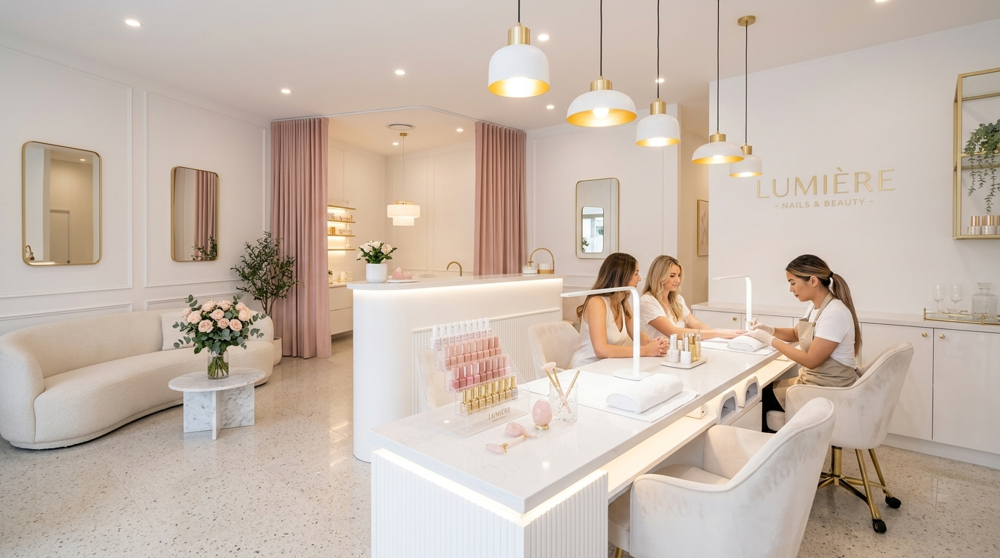

# 💎 LUMINA Beauty Studio Web Application



**LUMINA Beauty Studio** - สตูดิโอเสริมความงามระดับพรีเมียม เชี่ยวชาญด้าน **ทำเล็บ (Nails), ต่อขนตา (Lashes) และงานคิ้ว (Brows)** 

---

## ✨ คุณสมบัติเด่นของระบบ (Features)

- 🌐 **รองรับ 2 ภาษา (Dual Language TH/EN)**: สลับภาษาไทยและภาษาอังกฤษได้แบบเรียลไทม์ทุกหน้า
- ⏰ **เวลาทำการ 08:00 - 20:00 น. (Operating Hours)**:
  - แสดงสถานะ **"เปิดบริการ (OPEN NOW)"** / **"ปิดบริการ (CLOSED NOW)"** อัตโนมัติตามเวลาจริง
  - ระบบจองคิวจำกัดรอบเวลาให้เลือกตั้งแต่ 08:00 - 19:00 น. (คิวสุดท้ายปิดเวลา 20:00 น.)
- 💅 **เน้น 3 บริการหลัก (Nails, Lashes & Brows)**:
  - **Nails Artistry**: สีเจลออร์แกนิกนำเข้าจากญี่ปุ่น, ต่อเล็บอะคริลิก/พีวีซี, สปามือ-เท้า
  - **Eyelash Extensions**: ต่อขนตา Classic 1-on-1, Volume 3D-6D Hybrid, Keratin Lash Lift & Tint
  - **Eyebrow Micro-Art**: สักคิ้ว 6D Microblading, Powder Ombre, Brow Lamination
- 📅 **ระบบจองคิวออนไลน์ 4 ขั้นตอน (4-Step Booking Wizard)**:
  1. เลือกบริการ (เลือกได้หลายรายการ พร้อมคำนวณราคารวมและเวลา)
  2. เลือกช่างผู้เชี่ยวชาญ (Master Mayu, Master Ann, Brow Architect Jamie หรือช่างคนใดก็ได้)
  3. เลือกวันและรอบเวลา (08:00 - 19:00 น.)
  4. กรอกข้อมูล และคำนวณเงินมัดจำ 30%
- 🎟️ **ตั๋วยืนยันการจองดิจิทัล (Digital Booking Ticket & QR Code)**: พร้อมปุ่มสั่งพิมพ์/บันทึกตั๋ว
- 🛡️ **ระบบผู้ดูแลร้าน (Admin Portal)**: สรุปยอดการจอง รายได้ประเมิน และจัดการลบคิว/อนุมัติคิว
- 📋 **Spec Kit Integration**: พัฒนาด้วยกระบวนการ Spec Kit (`specs/001-nails-lashes-brows-salon/spec.md`)

---

## 🛠️ โครงสร้างไฟล์ในโปรเจกต์ (Project Structure)

```text
├── .specify/
│   └── feature.json         # Spec Kit configuration
├── specs/
│   └── 001-nails-lashes-brows-salon/
│       └── spec.md          # Specification document
├── assets/                  # รูปภาพผลงานและบรรยากาศร้าน
│   ├── hero.jpg
│   ├── nails.jpg
│   ├── lashes.jpg
│   └── brows.jpg
├── index.html               # โครงสร้างหน้าเว็บหลัก
├── style.css                # Style Guide (Clean Pearl & Modern White)
├── app.js                   # Business Logic & i18n Translations (TH/EN)
└── README.md
```

---

## 🚀 วิธีเปิดใช้งาน (Getting Started)

คุณสามารถเปิดใช้งานผ่าน HTTP Local Server ง่ายๆ ด้วย Python หรือ Node.js:

```bash
# ใช้ Python HTTP Server
python -m http.server 8080
```
จากนั้นเปิดเบราว์เซอร์เข้าที่ `http://localhost:8080`
